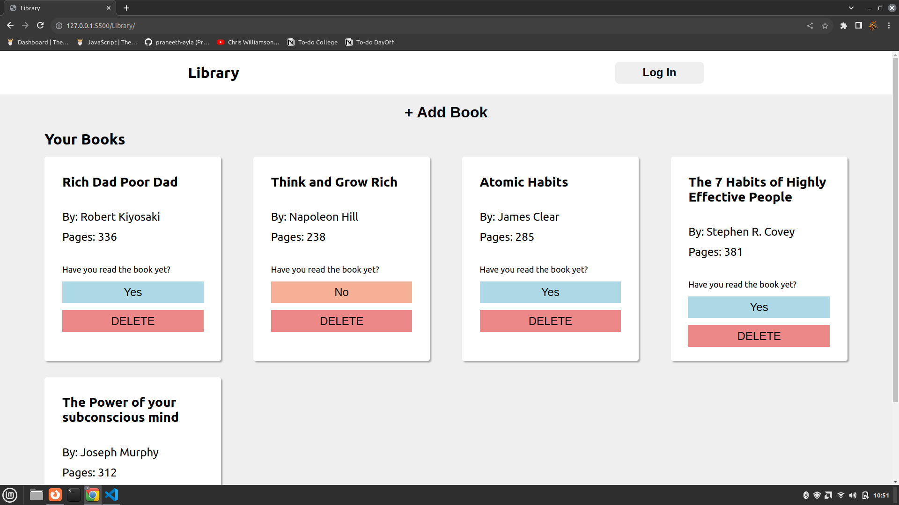

# My Library Project

[Live Demo](https://praneeth-ayla.github.io/Library/) | [The Odin Project](https://www.theodinproject.com)

## Description

This project is part of The Odin Project curriculum. It's a web application for managing your book library. You can add books to your library, mark them as read or unread, and delete books from your collection.



The screenshot showcases the project's user interface.

## Installation

To run the project locally, follow these steps:

1. Clone the repository to your local machine:

   ```bash
   git clone https://github.com/your-username/my-library-project.git
   cd Library
2. Open the project in your web browser by double-clicking the index.html file or using a local development server if you have one.

## Usage

* Click the "+ Add Book" button to add a new book to your library.
* Fill in the book's details and specify whether you've read it.
* Click the "Add" button to add the book to your library.
* Click on the "Yes" or "No" button to change the read status of a book.
* Click the "DELETE" button to remove a book from your library.

## Technologies Used

* HTML
* CSS
* JavaScript

## About The Odin Project

The Odin Project is a free, open-source curriculum for learning web development. You can learn more about it [here](https://www.theodinproject.com).
